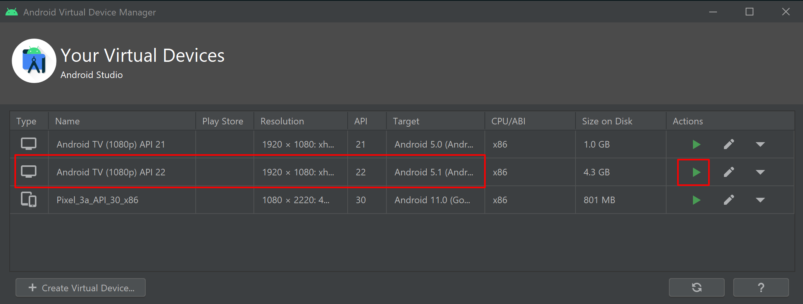
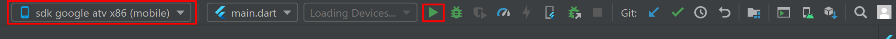
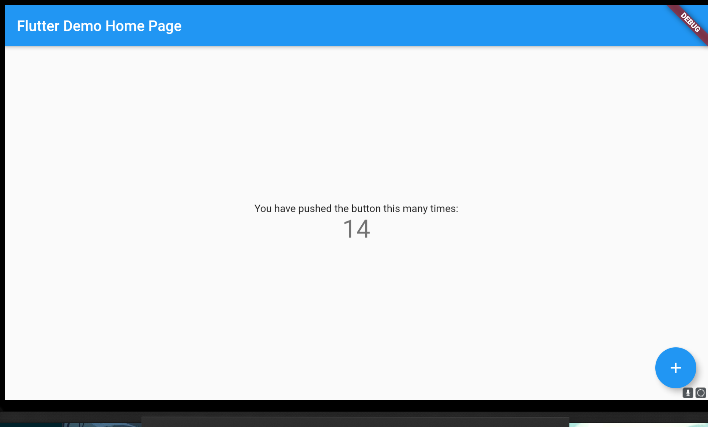

# ZY-Player-TV
ZY Player TV app, developed with Flutter

## 1. 设置Flutter环境
#### 1.1 按着https://flutter.dev/docs/get-started/install/windows 页面的指导,先安装好Flutter和Android Studio
#### 1.2 打开Android Studio, 依次打开Tools->AVD Manager, 生成一个新的虚拟机. 我们这里生成一个Android TV, API level=22 的一个虚拟机.点击播放按钮就会开始运行该虚拟机.
 
#### 1.3 在Android Studio,当可用设备列表出现"sdk google atv x86"字样的时候,点击后边的运行按钮

一切正常的话,你会看到如下运行结果
 
